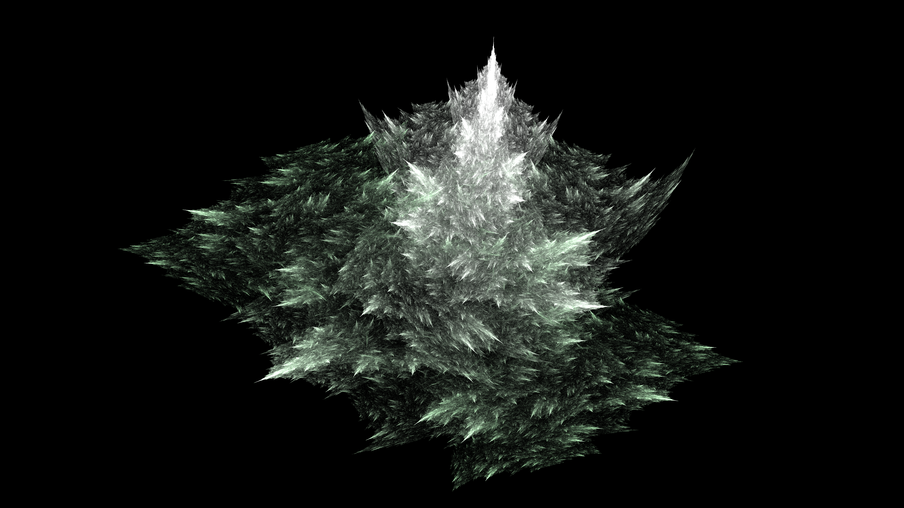
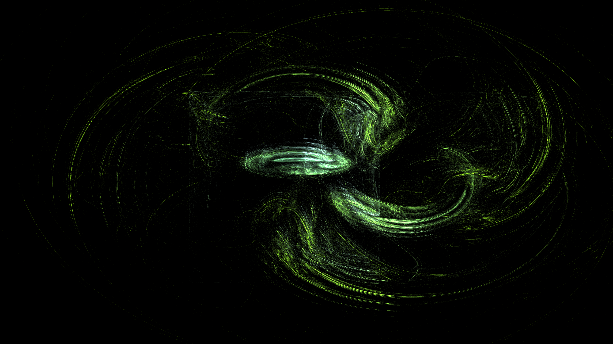
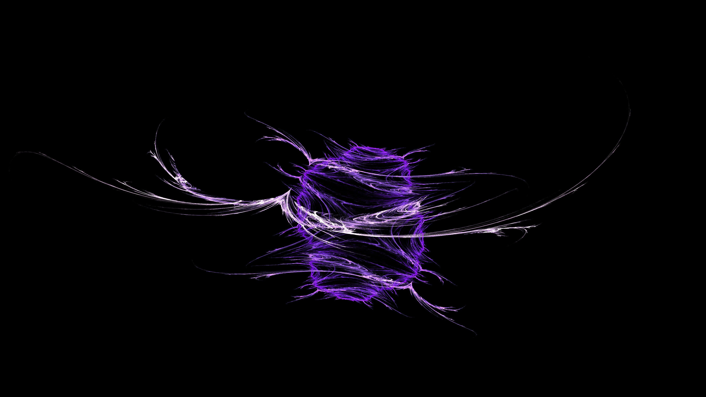
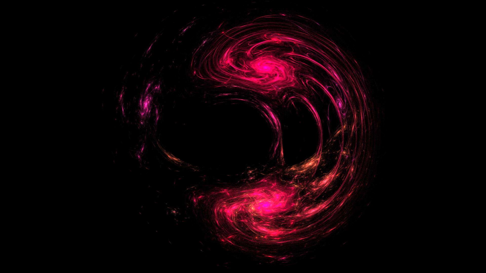
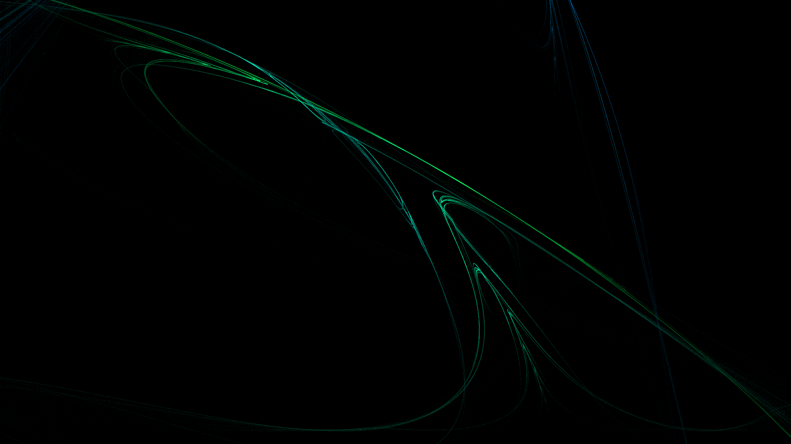
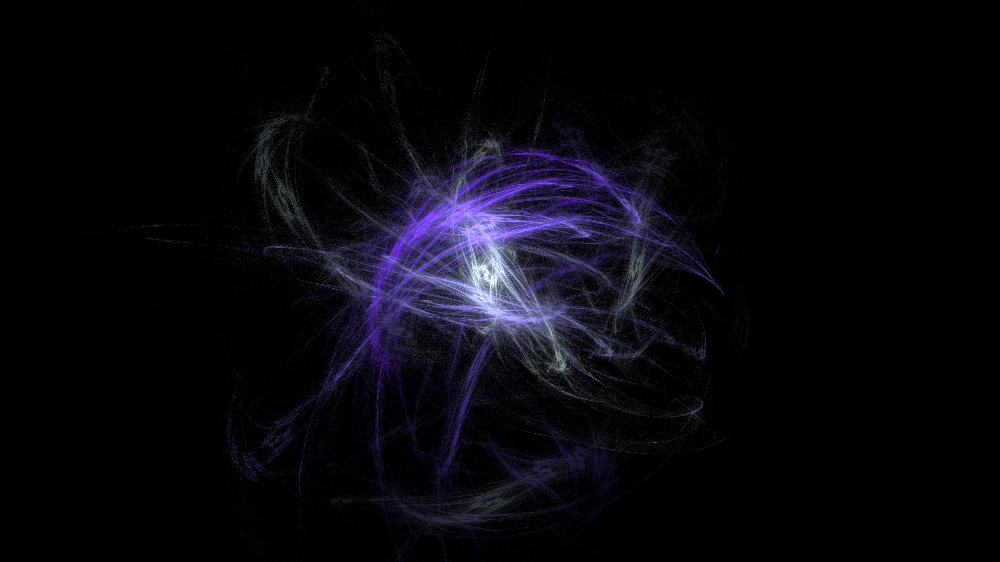
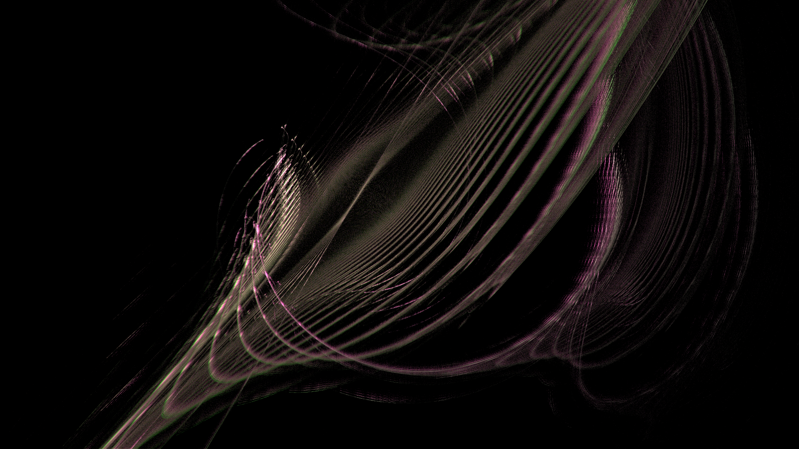
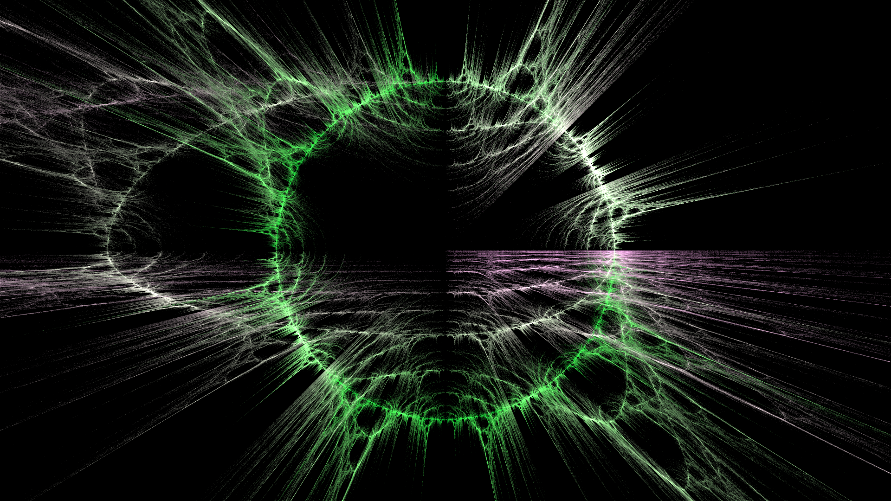

# Fractal Flame Iterated Function System
This program is for generating simple fractal flames, such as the examples below or in the examples folder: https://github.com/alexf13e/fractal-flame/tree/main/examples.

The program can be downloaded from the releases page: https://github.com/alexf13e/fractal-flame/releases.

See here for an explanation of how the images are produced: https://flam3.com/flame_draves.pdf.

|  |  |
|-|-|
|  |  |
|  |  |
|  |  |

## Installation
Download either the Window or Linux zip file from the releases page: https://github.com/alexf13e/fractal-flame/releases. Extract the contents of the zip file, then run the executable. You will probably get a smartscreen popup on Windows and I'm not important enough to stop that from appearing. Click run anyway if you trust me, or by all means build the program yourself.

For Linux:
* The program may not use the same GPU for OpenGL and OpenCL if you have more than one (e.g. in a laptop). If you have an Nvidia GPU, running `nvrun.sh` should make OpenGL and OpenCL use the same GPU. I do not have an AMD GPU available to test if a similar step is required for them.
* If you are using Wayland, I have been unable to get OpenGL and OpenCL to cooperate there, so it is currently unsupported (sorry).

## Usage
On startup, 3 random fractals are created. These can be edited and added to, with the results being gradually rendered to the screen as a preview.
The fractal can then be rendered to a file at the desired resolution and sample count.

### Controls
The keyboard or mouse can be used to move, rotate and scale the fractal. Rotating and scaling is always relative to the centre of the screen. Note that keyboard controls move the **camera**, i.e. pressing the `A` key will move the camera to the left, and therefore the fractal moves to the right.

Most boxes containing numbers can be clicked and dragged to change them, or hold `ctrl` and click once to type in a number. Holding `shift` while clicking and dragging will change the value 10x as fast, while holding `alt` will change it 10x slower.
Note that typing a value directly with `ctrl + click`  allows for some inputs to have their restrictions bypassed. This may be useful, but use at your own risk.

### Settings
* Pause/Resume - pauses/resumes the accumulation of samples. The camera cannot be moved while paused, as moving the view requires re-rendering the fractal.
* Clear image - resets the preview, clearing all accumulated samples.
* Clear every frame - prevents samples from accumulating by resetting the preview buffer every frame.
* Faster plotting - improves performance when lots of points try to render to the same pixel at the same time but consequently losing the colour from some points (disables atomic addition).
* Samples per frame - how many sample points will be calculated every frame of the preview. Higher values make the fractal appear faster, but reduce the interactive frame rate.
* Max preview samples - how many samples to render in the preview before stopping, can be set to 0 for infinite.
* Initial iterations - how many iterations should be applied to the sample point before it is rendered. This reduces noise from the random start point of the sample.
* Drawing iterations - how many iterations should be applied after the initial ones. The position of the sample point will be rendered after each of these iterations, and effectively just increases the number of samples per frame when initial iterations is sufficiently high (e.g. 20+).
* Gamma - the pixel value will be set to `pow(pixel, 1/gamma)` in a post processing step.
* Darkness - the pixel value will be multiplied by `1/darkness` in a post processing step before gamma. "Darkness" is chosen as opposed to brightness, as the slider is nicer to control this way.

### Camera
* Reset camera - resets the position of the camera to the centre of the world.
* Postion/zoom/angle - changes the respective values for the camera.
* Guidelines - draw an overlay with lines to help positioning the fractal within the frame. These lines are not drawn on the image when saving.

### Render
* Render resolution - the size in pixels of the output file. This does not affect the preview, which uses the resolution of the window. NOTE: the brightness of a pixel is proportional to the amount of times a sample point is rendered to it. Higher resolutions have a lower chance of each pixel being rendered to, and are often darker. Compensate for this with the darkness slider or more samples.
* Match preview size - forces the output resolution to match the window resolution. Untick to set resolution manually.
* Number of samples - the total number of samples which will be calculated for the rendered image.
* Match current preview sample num - forces the number of samples in the rendered image to match how many samples have been calculated so far in the preview. Untick this to set the number of samples manually.
* Save as image - click to select a location to save the image, and then it will be rendered.

### Info
Sometimes useful information will be displayed here. There may also be information in the terminal window, which is likely behind the main window.

### Variations
* Save flame config - saves the current set of variation settings to a file.
* Load flame config - loads a set of variation settings from a file.
* Previous flame - allows going back to the previous flame after loading from file or randomising (in case of accidentally going past a random flame you liked).
* Randomise [value] - randomises this value for each variation in the list. Useful for searching for nice shapes and colour schemes and forming a gambling addiction.
* Add variation - adds a variation with default settings.
* Variation - this is the main characteristic of the shape which will be formed, and refers to the list found here: https://flam3.com/flame_draves.pdf#page=16.
* Colour - the colour associated with the variation.
* Weight - affects the probability of this variation being chosen by a sample point. The chance of a variation being chosen is its weight divided by the sum of all weights. E.g. two variations with a weight of 1 will each have a 1/2 chance to be chosen, weights of 0.5 and 1 have 1/3 and 2/3 respectively.
* Rotation, translation and scale - transforms points every time that variation is used. Rotation and scale use the translation position as the centre.
* Remove - remove this variation from the list.

## Build Dependencies
* GLFW - https://www.glfw.org/
* glad - https://glad.dav1d.de/
* ImGui - https://github.com/ocornut/imgui
* Native File Dialog Extended - https://github.com/btzy/nativefiledialog-extended
* stb image - https://github.com/nothings/stb/tree/master
